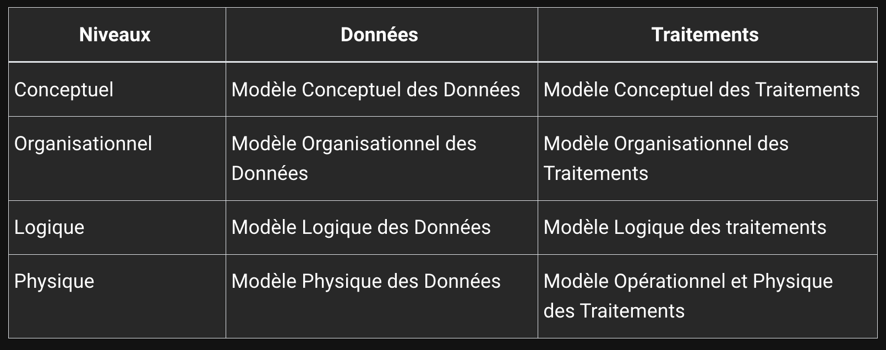
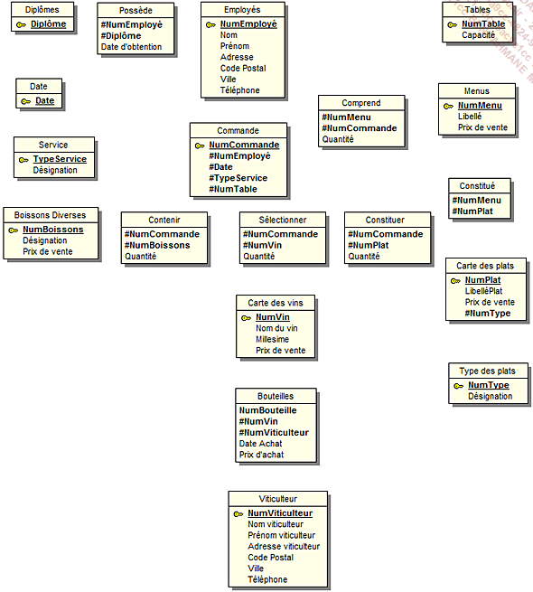
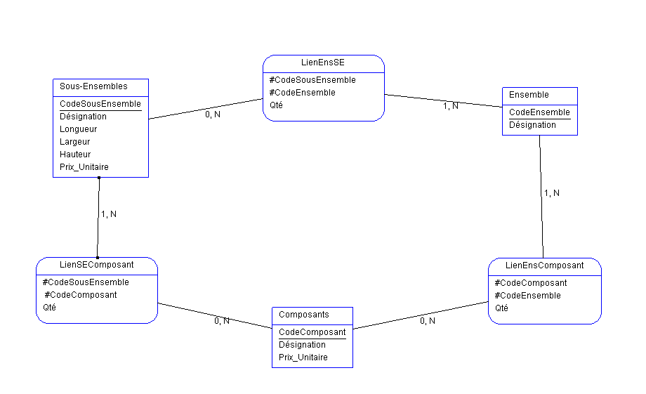
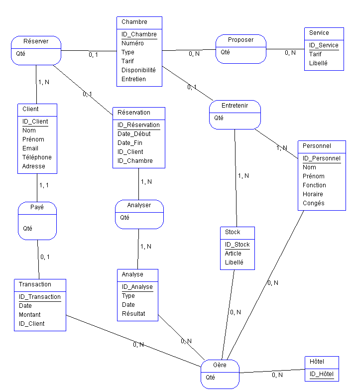
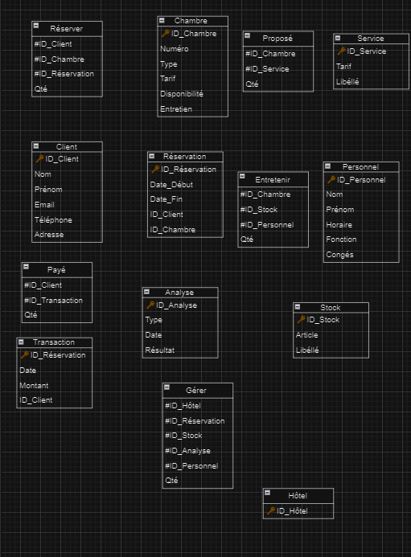
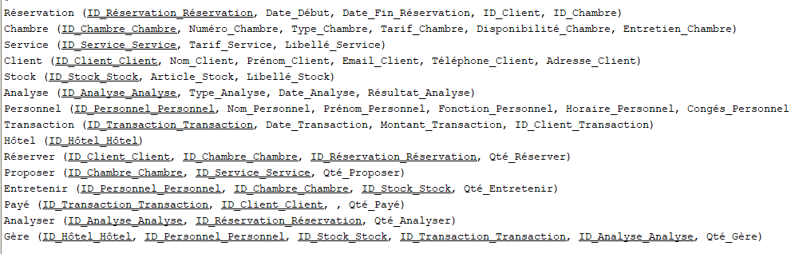

***
sh
git init
"cette commande va intialiser un depot Git, Git va traquer toutes les modifications effectuées au sein de ce dossier. "

***
Création de dépot 

Pour consulter l'état du dépot Git om suffit de lancer la commande :
***sh
git status
***

Pour sauvegarder il faut se placer a la racine et taper la commande :
*** sh
git commit -m "first commit"
***
Pour ajouter des fichiers non-suivis :
***bash
git add .
***


git add . 
git commit -m "first commit"

présentation géneral de Merise:
cette methode se caracterise par trois points clés :
- un approche dit systématique : on transforme les processus de l'entreprise en SI
- une séparation  des données et des traitements 
- une approche nivelée

### L'approche systématique

-le système de pilotage : 
Il est composer de l'ensemble des acteurs qui vont 'piloter' le système d'information 
-le système d'information : 
Il est composer de l'ensemble des acteurs qui vont 'utiliser' le système d'information
-le système opérant : 
Il est composer de l'ensemble des acteurs qui vont 'produire' les donnees du systeme d'information


### La separation des donnees et des traitements

La separation des donnees et des traitements permet de separer les donnees du système d'infomation et les traitements effectues sur donnees.
Cette demarche se fait en 3 etapes : 
-L'analyse des flux : on analyse les flux d'informations entre les acteurs du systeme d'information et les acteurs du systèmes operant
-L'étude des documents interne (factures, bon de livraison)
-L'etude des documents en externes (fournisseurs, clients), 

les differents types d'informations : 
- les infos de bases ou elementaires : ce sont les donnees de base du systeme d'informations 
-les informations calculees : ce sont les donnees calculees a partir des donnees de base
- les traitements ou les fonctions : ce sont les traitements effectue sur les donnees de base pour obtenir les donnees calculees 

En resume : vous devrez identifiees les donnees et les traitement effectue sur ces donnees 

### L'approche nivelée 

Pour effectuer la conception d'un SI, on va utiliser une approche nivelée. Cette approche se compose de 4 niveaux : 

-Le niveau conceptuel
-le niveau organisationnel
-le niveau logique
-le niveau physique

#### le niveau conceptuel

Le niveau conceptuel permet de modéliser les données de l'entreprise.
On va utiliser le modèle conceptuel de données (MCD) pour modéliser les données de l'entreprise, et le MCT pour modéliser les traitements effectué
sur ces données.

#### Le niveau organisationnel 

Le niveau organisationnel va permettre d'intégrer a l'analyse précedente toutes les notions de temporalité, de chronologie des opérations, de  contraintes géographique, des niveaud d'accès. On va utiliser le modele organisationnel des traitements et le modele organisationnel des traitement (MOT) et le modéle organisationnel des données (MOD) pour modéliser les traitements de l'entreprise.

En résumer on se pose les questions suivantes a partir des données recueillis au niveau conceptuel :

-**quand** les traintements sont-ils effectués ? 
-**Où** les traitements sont-ils effectués ?<br>
-Par **Qui* les traitements sont-ils effectués ?

#### Le niveau  logique

Le niveau logique va permettre de modéliser les données de l'entreprise en utilisant le modèle logique de données (MLD) et les traitement de l'entreprise en utilisant le modèle logique des traitements (MLT)

Le MLD est independant des languages de programmations et SGBD(Systeme de Gestion de Base de Données).

On repond a la question : **Avec Quoi** les traitements sont-ils effectues ?

#### Le niveau physique

Il s'agit de l'organisation `réelle` des données. on va utiliser le modèle physique de données (MPD) et le modèle physique des traitements (MPT).

Ici, on apporte les solutions technique de stockage des données et de traitement des données.

On reponds a la question : **Comment** les traitements sont-ils effectués ?

#### Résumé : les 4 niveau de Merise 



### Des données aux dépendances fonctionnelles

Pour être intégrées dans un SI, les données doivent être triées et organisées. On va souvent tenter de les classer par type de données :

- Chaine de caratctères, format texte
- Type alphanumérique, format texte
- Le type numérique (intégrer, float)
- Le type date (date, datetime, timestamp)
- Le logique ou booleen (true, false)

Creation d'un dictionnaire de donnees 


### Les dépendances fonctionnelles 

Une dépendance fonctionnelle est une relation entre deux attributs d'une table. Elle permet de définir une relation de dépendance entre deux attributs d'une table.

 


Le but de l'exercice est d'elaborer un MCD a partir d'un dictionnaire de donnees.

Ici on va introduire les notions d'entités, de relation et de propriétés.

#### Les propriétes sont les informations de base d'un SI.


#### Les entités sont les objets du SI.


Quelques définitions :
    - entité forte : une entité qui ne dépend pas d'une autre entité pour exister
    - entité faible : une entité qui dépend d'une autre entité pour exister

#### Les relations


**Les cardinalités** : Elle permettent de définir le nombre d'occurences d'une entité par rapport à une autre entité dans le cadre d'une relation.


Petit Exemple : 


#### Les relations "porteuse"

Une relation est dite porteuse si elle possede des proprietes.

#### Les relations reflexives

Une relation est dite reflexive si elle relie une entite a elle meme.


Quelques regle de conception : 

- toute entite doit avoir un identifiant
- toutes les propriéter dependant fonctionnellement de l'identifiant
- le nom d'une propriete ne doit  apparaitre qu'une fois dans le MCD : si vous avez une entite Eleve et une entite Professeur, vous ne pouvez pas avoir une proprieté nom dans les deux entités. Il faut donc renommer la propriéter nom de l'entite Professeur en nomProfesseur par exemple.
- les proprietes issues d'un calcul ne doivent pas apparaitre dans le MCD.

Le rôle d'une dependance fonctionnelle est de permettre de definir une relation de dependance entre deux attribut d'une table : une donnée A depend fonctionellement d'une donnée B lorsque la valeur de B determine la valeur de A.

Pour formaliser une dépendance fonctionnelle on utilise la notation suivante: 
Numéro adhérant `(Nom, Prénom, CP, Ville, Téléphone, Date d'adhésion,  mail)`

La partie gauche (numéro adhérant) est la `source` de la dépendance fonctionnelle.
La partie droite désigne le `but` de la dépendance.

#### Les dépendance fonctionnelles composées

Si une dépendance fonctionnelle qui fait intervenir plus de deux attributs on parle de dépendance fonctionelle composée.

Exemple : Pour connaître le temps d'un coureur sur une etape donnée il nous faut son numéro ou son nom ainsi que le nom ou le numéro de l'étape.

Formalisation :
`(numéro coureur, numéro étape)   (temps)`

#### Les dépendances fonctionnelles élémentaires

Une dépendance fonctionnelle A -> B est élémentaire s'il n'existe pas une donnée C, sous-ensemble de A, décrivant une dépendance fonctionnelle C -> B

Exemples :
- RefProduit -> LibelleProduit
- NumCommande RefProduit -> QuantiteCommande
- <strike> NumCommande RefProduit -> DésignationProduit </strike>

#### Dependance fonctionnelle elementaire directe
"On dit que la dépendance fonctionnelle A -> B est directe s'il n'exite aucun attribut C tel que l'on puisse avoir A -> C et C -> B.
En d'autres termes, cela signifie que la dépendance fonctionnelle entre A et B ne peut pas être obtenue par transitivité."

Exemple : 
- RefPromo -> NumApprenant
- NumApprenant -> NomApprenant
- RefPromo -> NomApprenant : RefPromo -> NumApprenant -> NomApprenant

#### Les contraintes d'integrité fonctionnelles (CIF)

Définition : Une CIF est définie par le fait qu'une des entites de l'association est completement determinee par la connaissance d'une ou de plusieurs entites participant a l'association.

Exemple : 


Une salle peut contenir 0 ou plusieurs ordinateurs. Un ordinateur existe dans une et une seule salle.
Dans ce type de relation une CIF existe si on a une cardinalite 1,1

### Modele logique des donnees (MLD)

Le MLD est la suite du processus Merise, on se rapproche un peu plus de la base de donnees.
#### Cas simples
Partons du MCD suivant : 


**entité propriété relation** cardinalités

Nous arrivons au MLD suivant :


L'`entité` qui possede la cardinalité 1.1 ou 0.1 absorbe l'identifiant de l'entité la plus forte (0.n ou 1.n). Cet identitifiant devient alors une clé étrangère.
#### Cas (0,n), (0,n) ou  (1,n), (1,n)

Partons du MCD suivant :


Dans le cas ou la `cardinalité max` est n est deux cotes, on va crée une entité intermediaire qui va contenir les deux clés étrangère des deux entités.


Continuons avec le MCD suivant : 


On obtient le MCD suivant en suivant la même logique : 


#### Cas d'une relation reflexive 

Partons du MCD suivant : 


#### Regles de passage du MCD au MLD

Règles simples de passage du MCD au MLD
L’entité qui possède la cardinalité maximale égale à 1 recevra l’identifiant ou les identifiants des entités ayant les cardinalités maximales les plus fortes.

Les relations ayant toutes leurs entités reliées avec des cardinalités maximales supérieures à 1 se transformeront en entité en absorbant les identifiants des entités jointes.

Toute relation porteuse de propriétés se transformera en entité et absorbera comme clé étrangère les identifiants des entités qui lui sont liées.

Toute relation réflexive se transformera en entité et absorbera comme clé étrangère l’identifiant de l’entité qui lui est liée.

#### Petit exercice pratique


Voici le MLD 



### Modele physique des données (MPD)

Voici le schema relationnel correspondant au MLD precedent :

Diplômes (Diplomes)

Possède (#NumEmployé, #Diplôme, Date d’obtention)

Employés (NumEmployé, Nom, Prénom, Adresse, Code Postal, Ville, Téléphone)

Tables (NumTable, Capacité)

Date (Date)

Service (TypeService, Désignation)

Boissons Diverses (NumBoissons, Désignation, Prix de vente)

Contenir (#NumCommande, #NumBoissons, Quantité)

Commande (NumCommande, #Numemployé, #Date, #TypeService, #NumTable)

Comprend (#NumMenu, #NumCommande, Quantité)

Menus (NumMenu, Libellé, Prix de vente)

Constitué (#NumMenu, #NumPlat)

Constituer (#NumCommande, #NumPlat, Quantité)

Sélectionner (#NumCommande, #NumVin, Quantité)

Carte des vins (NumVin, Nom du vin, Millesime, Prix de vente)

Carte des plats (NumPlat, LibelléPlat, Prix de vente, #NumType)

Type des plats (NumType, Désignation)

Bouteilles (NumBouteille, Date Achat, Prix d’achat, # NumVin, #NumViticulteur)

Viticulteur (NumViticulteur, Nom viticulteur, Prénom viticulteur, Adresse viticulteur, Code postal, Ville, Téléphone)

A partir d'ici il est facile de generer le script SQL correspondant.

```SQL
CREATE TABLE CARTE_DES_VINS
   (
   NUMVIN INTEGER(2) NOT NULL ,
   NOM_DU_VIN CHAR(40)   ,
   MILLESIME INTEGER(2)  ,
   PRIX_DE_VENTE REAL(5,2)
,
    PRIMARY KEY (NUMVIN) CONSTRAINT PK_CARTE_DES_VINS
   );

CREATE TABLE BOUTEILLES
   (
   NUMVITICULTEUR INTEGER(2) NOT NULL ,
   NUMVIN INTEGER(2) NOT NULL ,
   NUMBOUTEILLE INTEGER(2) NOT NULL ,
   DATE_ACHAT DATE(8) ,
   PRIX_D_ACHAT REAL(5,2)
,
    PRIMARY KEY (NUMVITICULTEUR, NUMVIN, NUMBOUTEILLE) CONSTRAINT
PK_BOUTEILLES
   );


CREATE TABLE VITICULTEUR
   (
   NUMVITICULTEUR INTEGER(2) NOT NULL ,
   NOM_VITICULTEUR CHAR(20) ,
   PRÉNOM_VITICULTEUR CHAR(20) ,
   ADRESSE_VITICULTEUR CHAR(40) ,
   CODE_POSTAL CHAR(5) ,
   VILLE CHAR(40) ,
   TÉLÉPHONE CHAR(15)
,
    PRIMARY KEY (NUMVITICULTEUR) CONSTRAINT PK_VITICULTEUR
   );
```

##### Exercice 1 : 
MCD :


MLD : 


schema relationnel : 

Animaux (NumAnimal_Animaux, Race_animal_Animaux)  Légumes (NumLégume_Légumes, Nom_fruit_Légumes, Prix_fruit_Légumes)  Fruits (NumFruit_Fruits, Nom_fruit_Fruits, Prix_fruit_Fruits)  Info_de_vente (NumInfo_Info_de_vente, Poids_Information_de_vente, Vente_journalières_Info_de_vente, #agriculteur_numagriculteur_agriculteur)  Agriculteur (NumAgriculteur_Agriculteur, Nom_Agriculteur, Prénom_Agriculteur)  Vendre (NumLégume_Légumes, NumFruit_Fruits, NumAnimal_Animaux, NumInfo_Info_de_vente, Quantité_Vendre)  


## Les formes normales (FN)

Ensemble de regles qui a pour but d'eviter les anomalies au sein des BDDR. 
Pour appliquer les concepts des formes normal il est necessaire de connaitre les trois premières formes normales.

### Forme normale 1 (1FN)

Une relation est la première forme normal si : 
- tous les attributs sont atomiques
- les attributs ne contiennenent pas de valeurs repetitves

Exemple : 
Clients (NumCli, Nom, Prénom, Adresse, Telephone)


### Forme normale 2 (2FN)

Une relation est une deuxième forme normal si : 

- Elle est en 1FN 
- Si tous les attribut qui ne sont pas des clés ne dépendant pas d'une partie de la clé primaire

Exemple : 

Commande(NumClient, CodeArticle, Date, QteCommande, Designation)


### Forme normale 3 (3FN)

Une relation est une troisième forme normal si :

- Elle est en 2FN
- Si toutes les dépendances fonctionnelles sont directes

Les attribut non clé primaire ne dependent pas d'un attribut non clé primaire

Exemple : 

Commande (NumCommande, #CodeClient, #RefArticle)


### Les diagrammes des flux

Les diagrammes des flux permettent de modéliser les flux d'informations entre les acteurs du systèmes d'information et les acteurs du systèmes opérant

Quelques définitions : 
- Domaine d'étude : Le périmètre d'une activité au sein d'une entreprise, d'une activité spécifique
- L'acteur :  une personne, un service, une entreprise, un système informatique qui intervient dans le domaine d'étude au moyen d'un flux information
- Les flux : les informations qui circulent entre les acteurs, représente par une flèche et porte un nom et peut être numeroté (par soucis de chronologie) 

Représentation graphique : 


Quelques règles à respecter : 

- Un flux ne peut pas être bidirectionnel
- Un flux ne doit pas être reflexif
- On ne représente pas les flux entre les acteurs externes

## UML

UML : Unified Modeling Language (language de modélisation unifié) est un langue de modélisation de données. UML à été normaliser en 1997 par l'OMG (Object Management Group). Son but est de mettre en forme les concepts orientés au travers de diagramme.

UML propose 13 diagrammes de façon hiérarchique et se complètant.

1. les diagrammes statique : Ils permettent de modéliser la structure d'un système 
- Diagramme de classe
- Diagramme d'objets
- Diagramme de composant
- Diagramme de déploiement
- Diagramme de paquetages
- Diagramme de structure composite

2. Les diagrammes comportementaux : 

- Diagramme des cas d'usage
- Diagramme etat-transitions
- Diagramme d'activité

3. Les diagrammes dynamiques :

- Diagramme de séquences
- Diagramme de communication
- Diagramme global d'intéraction
- Diagramme de temps 

### Analogie Merise / UML 
 
1. Cas du MCD et du diagramme des classes

Le MCD et le diagramme de classes partagent beaucoup de points communs. Les différences majeures apparaissent dans le côté objet d’UML. Cependant, au niveau du processus d’analyse, le diagramme de classes se rapproche plus du modèle logique des données. Le langage UML pour représenter une base de données ne passe pas d’un état correspondant à un MCD à un MLD. Il faut donc à l’analyste une bonne approche ou vision de la base de données pour la représenter sans faille en langage UML. Le découpage MCD, MLD apporte plus de sécurité, à ce niveau-là, qu’UML.


Representation d'une relation :


Exercice 2 : 

MCD : 



MLD : 


schema relationnel : 


Exercice 3 : 

MCD : 


MLD : 


schema relationnel : 


Exercice 4 : 


Voici mon MCD de l'examen : 



MLD: 



Schéma Relationnel : 



